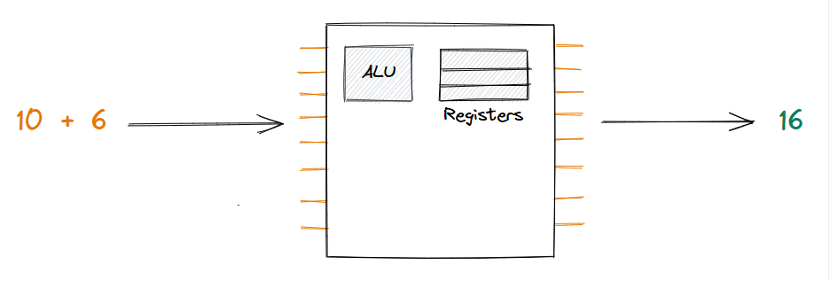
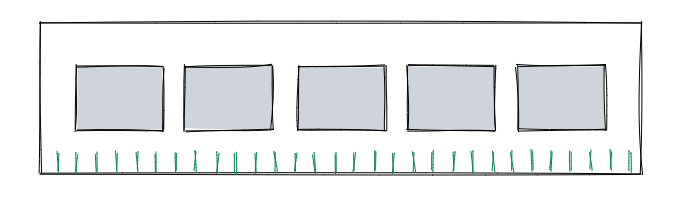
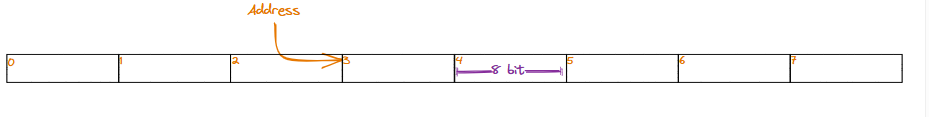
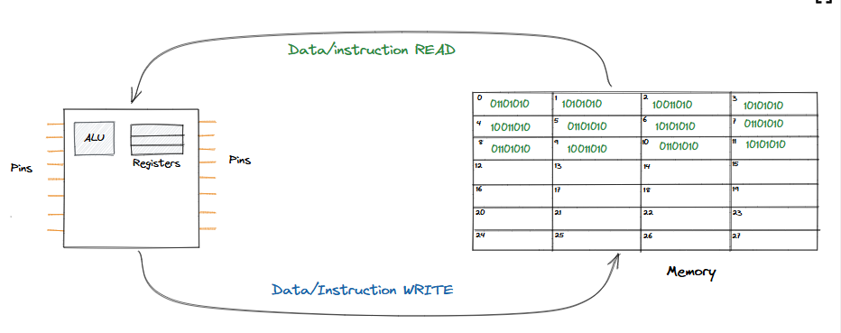

### Understanding the memory model

Before delving into basic data structures such as array, it is crucial to understand the concept of data and how it is stored in computer memory. What exactly is computer memory, and why is it necessary? How does a program execute? Understanding these fundamentals is essential for understanding data structures and their applications in solving real-world problems. In this lesson, we will examine a simple memory model compatible with most programming languages to provide a clear understanding of how various data structures store and manipulate data.

### Memory

We must first understand computer memory before diving into the memory model. To understand memory, let's consider the example of adding two numbers. We know the CPU can add two numbers and give us the result, but how is this result stored?

* The CPU can add two numbers and produce the result

There must be a place to store this result and retrieve it later for other operations. This is exactly where computer memory comes into the picture. Computer memory (RAM) is a complex chip, much like the CPU. However, this chip performs a different set of functions: unlike the CPU, which carries out computational tasks such as addition and subtraction, the main purpose of computer memory is to store data.

* The computer memory (RAM) is yet another chip

Since the computer memory (RAM) is also a chip, it only understand digital signals in the form of high(1) and low(0) voltage. To work with computers, we must convert everything (including data) into 0s and 1s. Fortunately, this conversion is quite simple, and all real-world data can be easily converted into 0s and 1s by converting it to its **binary form** either directly or by applying various encodings. Numbers can be converted to their binary form by converting them to base 2. Non-numeric data can first be **encoded** as numbers and then converted to binary.

### The memory model

When writing source code for software applications, developers shouldn't have to worry about the low-level details of computer memory. A memory model abstracts how copmuter memory operates, making it easier to understand how the code interacts with memory. It also helps programmers understand how data is stored, retrieved, and updated, giving a clear mental picture of how a program interacts with its data.

The easiest way to visualize memory is to imagine it as a long chain of nubmered boxes starting from `0` and ending at `n-1`, where `n` represents the total number of boxes. This visualization is all a developer needs to care about 99% of the time when writing software applications.

* Memory can be visualized as a linear sequence of numbered blocks.

The above diagram illustrates that memory is made up of numerous boxes capable of holding data. Each box consists of **8 bits**, with each bit representing a switch that can be either on (1) or off (0). Therefore, computer memory is essentially a series of bits organized into groups of 8, known as **byte**, which serve as the basic unit of data, much like a meter serves as a unit of distance.

* 1 bit is a binary digit that can either by 0 or 1
* 1 byte is made up of 8 bits

We can easily store data in memory, but to retrieve it, we need to uniquely identify each byte to determine where to find the data. The simplest way to uniquely identify each byte is to use its relative position from the first byte as its identifier. This unique identifier of a byte is also known as its **address**.

> The address of data in memory is the first byte from where the data starts

Ther computer memory is connected to the CPU and is used during instruction execution to store and retrieve data. The CPU and memory work toegether much like the human brain, with certain parts of the brain helping to break down complex problems, and other parts enabling them to retain intermediate results.

### Program Execution

When we run a program by executing the machine code generated by the compiler from our code, the entire machine code is initially loaded into memory. The CPU executes the program by reading instructions sequentially from memory, starting at the first address of the code.

* Execution of a program in a computer.

Memory stores both the program and the data that this program creates or manipulates. This memory model is useful to understand the inner workings of storage and retrieval of primitive data types, such as integers, characters, and floats, as well as the interaction of pointers with data.