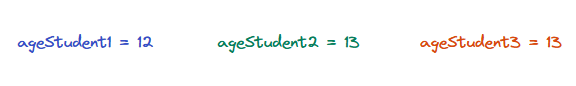
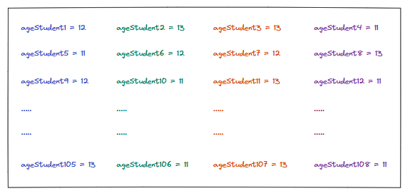

### Understanding the problem

To understand an array and why we need it, let's look at some common problems that programmers face when designing software systems. When writing a program, we often need a collection of data items that can be accessed sequentially. For instance, we might need a collection of the ages of all the students in a class. If there are only a few students in a class, we can store their names in separate variables.

* Using variables to store the ages of 3 students.

This is an easy way to store data, but what if there are hundreds of students in the class? In this case, we need to create hundreds of variables to store this data.

* Using variables to store ages of 108 students

While this solution solves the problem at hand, storing and managing hundreds of values in hundreds of variables is error-prone and not scalable.

### Limitations of using variables

Variables that store different types of data can be extrememly useful. However, using variables to store data has its limitations.

* A variable can store only one value at a time.
* Different variables that store the same type of information must have different names.
* Too many variables complicate the source code and the programming logic, making it error-prone.
* Using variables to store lots of data is not scalable.

Computers are designed to solve problems at scale, managing large amounts of data that humans cannot handle. Problems like these are very common when desigining even the simplest software. that is why even the lowest-level programming languages, such as assembly, inherently support a data structure for storing multiple values together.