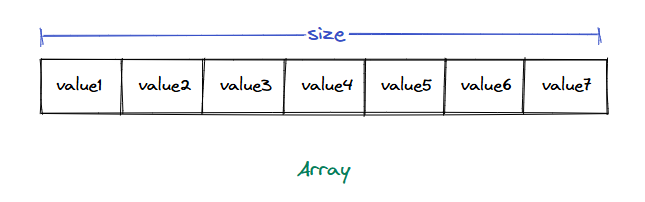
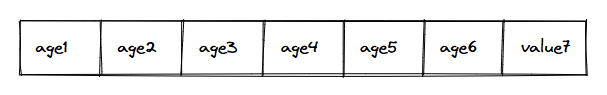

### Exploring a possible solution

Now that we understand the limitations of using variables and how they prevent us from desigining solutions at scale, we can look at the data structure designed to address these problems.

An array is a contiguous segment of memory that can store multiple data items simultaneously. In its simplest form, an array has a fixed size and can store only a fixed number of data items. All items in an array must be of the same type.

  * An array data structure.

Let us revisit the problem of storing the ages of all students in a class. We could solve the problem by storing the age of each student in a separate variable, but it does not scale well when dealing with tens of hundreds of students. An array helps us solve this, as we can create a single array to store the ages of all students.

  * Storing the ages of students in a class in an array
