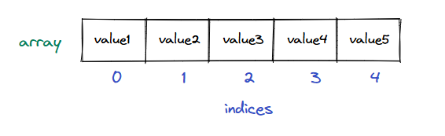
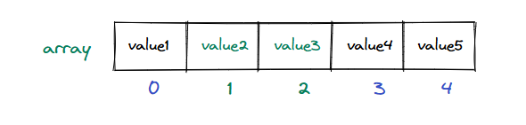
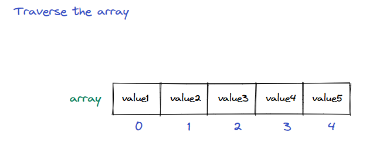

### Overview of supported operations

Now that we now the logical representation of an array, let's examine how to create, update, and traverse one. Almost all major programming languages support arrays in some form.

### Creating an array

The syntax and rules for creating an array depend on the programming language. An array with a fixed size cannot be modified after creation, and all data items in an array must be of the same type.


  * Creating an array of fixed size and datatype

Higher-level programming languages like JavaScript and Python inherently only provide a list instead of an array. A list behaves just like an array, but has a dynamic size and can store elements of different data types. However, the underlying machine-level implementation still uses the basic arrays as the core data structure, which has a fixed size and type.

```python
from typing import List

# Python lists are dynamic and can grow or shrink at runtime

# Declaring an array (list) of fixed size with default values
numbers: List[int] = [0] * 5

# Declaring and initializing an array
numbers2: List[int] = [1, 2, 3, 4, 5]

# Creating an array of size N
size_n: int = 5
numbers3: List[int] = [0] * size_n

# Creating and initializing using list comprehension
nubmers4: List[int] = [i for i in range(5)]
```

### Accessing elements in an array

An array is just a collection of data items stored in continuous memory. This continuous memory layout allows us to access its elements using indices. We use the subscript operator `[]` with an index to access data items in an array.

> **Why do array indices start from 0 instead of 1?**\
\
> Array indices start from 0, indicating an element's **relative** position from the array's beginning. This makes the element at index 0 the first element, the element at index 1 the second, and so on.


  * Array elements are accessed via their indices.

Different programming languages provide different ways of accessing elements within an array. However, the underlying access mechanism is the same for all.

```python
from typing import List

# Initializing an array (list)
numbers: List[int] = [1, 2, 3, 4, 5]

# Array elements are accessed using the 
# subscript [] operator
print("1st value:", numbers[0])
print("5th value:", numbers[4])
```

### Modifying elements in an array

Elements in an array can be modified in place just like value held by variables. Just like modifying a value held in a variable, to modify a value in an array, we write the accessor `array[index]` on the left side of the assignment operator and the value to be assigned on the right side.


  * Array elements can be modified via their indices

Different programming languages implement the underlying operations differently. However, the underlying mechanism to update the values at the core is the same.

```python
from typing import List

# Initializing an array (list)
numbers: List[int] = [1, 2, 3, 4, 5]

# Modifying array elements using the
# subscript [] operator
numbers[0] = 10
numbers[2] = 30
numbers[4] = 50

# Printing modified values
print("1st value:", numbers[0])
print("3rd value:", numbers[2])
print("5th value:", numbers[4])
```

### Traversing an array

Traversal is one of the most common operations performed on an array. It is the only way to search for a value in an array and is implmented by using a loop control variable as an index (starting from 0). To safely traverse an array, the size of the array should be known.


  * Traversing an array using a loop control variable 'index'

Higher-level programming languages have built-in functions within the array to get its length. For lower-level languages like C/C++, however, the programmer needs to keep track of the array's size.

```python
from typing import List

# Initializing an array (list)
numbers: List[int] = [1, 2, 3, 4, 5]

# 1. Traversal using index-based for loop
for index in range(len(numbers)):
    print(numbers[index])

# 2. Traversal using direct for-each loop
for value in numbers:
    print(value)

# 3. Traversal using enumerate (index + value)
for index, value in enumerate(numbers):
    print(index, value)

# 4. Traversal using while loop
index: int = 0
while index < len(numbers):
    print(numbers[index])
    index += 1

# 5. Reverse traversal
for index in range(len(numbers) - 1, -1, -1):
    print(numbers[index])
```