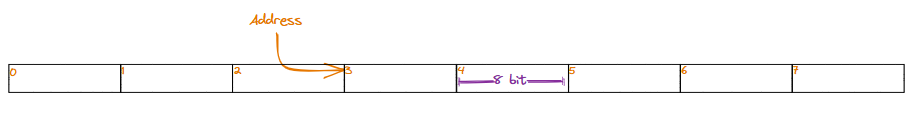
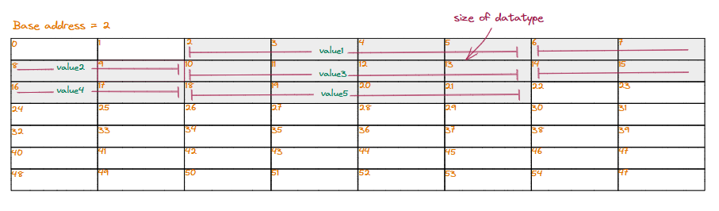
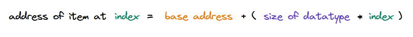

### Internal mechanics of arrays

So far, we learned what an array is and how it solves problems where we need to store and manipulate large-scale data easily. We can now look at how the array data structure works under the hood and what makes it so fast and easy to use.

### Memory addresses

Array elements are accessed using indices because arrays are store contiguously in memory. To better understand the relationship between array elements and indices, let us revisit the memory model we learned earlier.

> Note that this is how an array data structure is stored at the lowest level. Higher-level programming languages abstract all this from the user, but at their core, use the same mechanism.

  * Memory is logically organized as a linear sequence of blocks.

Memory is logicall organized in RAM as a sequence of blocks, each 1 byte (8 bits) long. Every block has a unique identifier that can be used to locate it in memory, called its address. The address is nothing but a number that is the relative position of the block from the start (starting from 0).

### Layout in memory

An array is just a **continuous** segment of memory that stores data of a single type. Each data item in the array has a fixed size equal to the size of its data type, so the total size of an array is the sum of the size of all data items.

> **Base address**\
The address of the block of memory where an array starts is also called the array's base address. The base address, along with the index, is used to access data items in an array.

  * Structure of an array in memory

### Accessing data items

Now that we know how an array is mapped into continuous memory, it is easy to figure out a mathematical formula to calculate the address of a data item at a given `index` if we know the **base address** (where the array starts in memory) and the **size** of each data item.

  * Calculating the address of a data item stored at a given index in an array

> Since the array index passed is added to the array's base address, we must add 0 to access the first element. This is why indices in an array start with 0 and not 1.