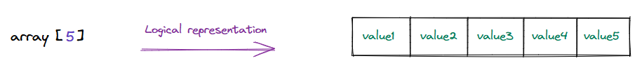
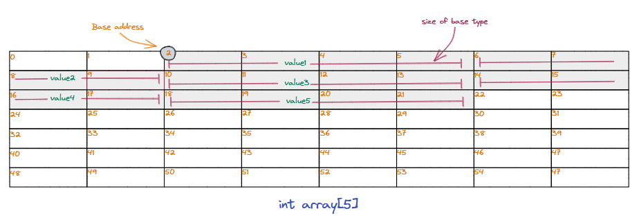
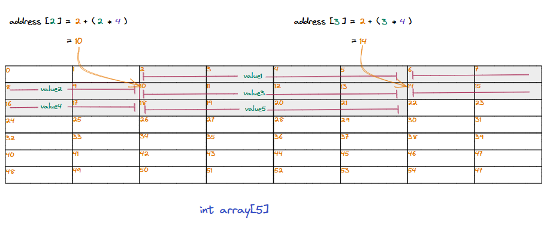
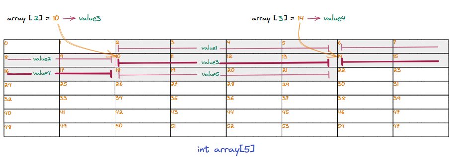

### Working example

Now that we know how an array is stored in the memory, we can use an integer array as an example to visualize this and understand what happens under the hood when we try to access a data item using the subscript operator(**[]**) within an index. Given below is the logical representation of an integer array with 5 data items.

  * Logical representation of an integer array with 5 data items.

### Layout it memory

We map the array into the memory starting at **base address 2**. Because this is an integer array, we consider the size of each data item to be **4 bytes** for this example.

  * An array of 5 integers mapped into continuous memory starting at address 2.

### Calculating address of data items

When we use the subscript operator (**[]**) with an index, that index and the size of the datatype stored in the array are used to calculate the address of the corresponding data item using the formula we learned earlier. The program knows the array's base address and the size of the stored data type; this is all it needs to access data at any index.

  * Calculating the address for array[2] and array[3] using subscript operator.

### Deferencing the value

Calculating the address of the value that has to be read/updated is only half the work. The next step is to interpret the stored value. The program knows the type of data stored there. To interpret the value at the calculated address, the entire sequence of bytes, starting from the resolved address to the size of the data item (a 4-byte integer in our example), is read.

> Lower-level programming languages such as C and C++ provide pointers that store memory addresses and allow the programmer to manipulate any part of a contiguous memory segment as they see fit.

> **Dereferencing**\
Dereferencing is accessing the value stored at the memory address held by a pointer. The pointer's data type determines how the value is interpreted.

  * Dereferencing data at addresses by looking at the datatype of the stored item.

> We considered an array of 4-byte integers in this example, but the underlying implementation is the same for any other datatye.

All this magic happens under the hood for almost all moder programming languages, so programmers don't have to worry about these things when developing software. They can use the array data structure to store data of any data type, and the programming language handles the underlying logic for accessing data.