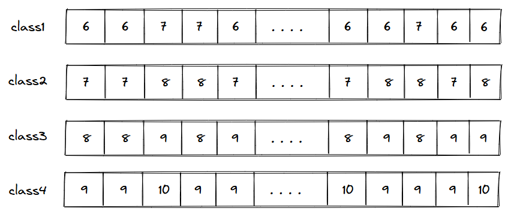
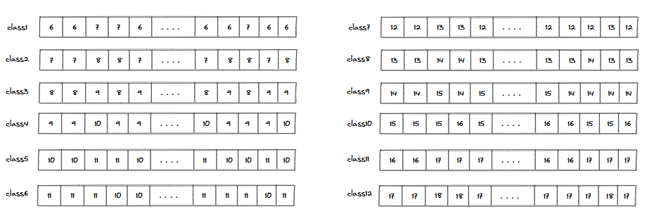

### Understanding the problem

Now that we understand what an array data structure is and how to use it, solving problems involving multiple data items of the same type may seem straightforward. However, this is not always the case. What we have learned so far is called **single-dimensional arrays**. To better understand situations where this approach may not be sufficient, let us examine an example.

We will build on the example introduced earlier when learning about arrays to better understand multideminsional arrays. Consider a scenario where we need to store the ages of students for every class in a school. The school has classes ranging from 1st standard to 4th standard, and each class consists of 60 students.

We can create four different integer arrays of size 60 to represent all four classes and store students' ages in these arrays.

  * Creating 4 arrays to store the ages of students in 4 classes

This approach works for a small number of classes, but what if there were 12 classes instead of just four? In that case, we would need to create 12 separate arrays. While this would technically solve the problem, storing and managing so many arrays across multiple variables would be cumbersome. This would bring us back to square one and undermine the very purpose of using arrays.

  * Creating 12 arrays to store the ages of students in 12 classes

### Limitations single dimension arrays

A lot can be done using simple single-dimension arrays. However, single-dimensional arrays have their limitations.

> * Different arrays holding the same type of data must have unique names
> * Using multiple arrays to store related data is not scalable
> * Having too many arrays makes the code complex and error-prone
> * Data relationships are harder to represent when spread across separate arrays

As mentioned earlier, computers are designed to solve problems on a large scale, and challenges like these often arise even when developing even very simple software. For this reason, even low-level programming languages provide built-in support for adding multiple dimensions to arrays.