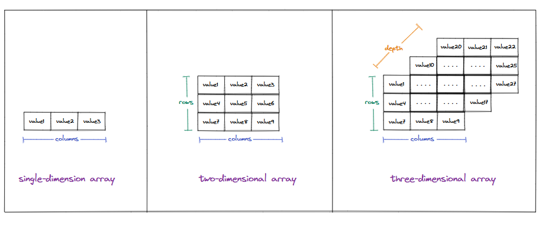
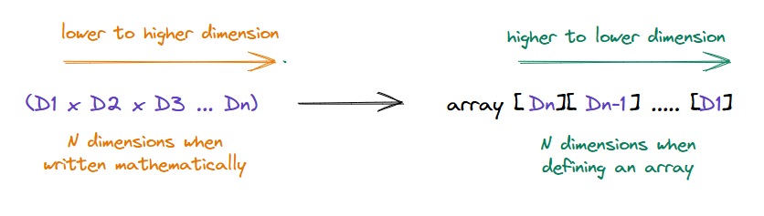
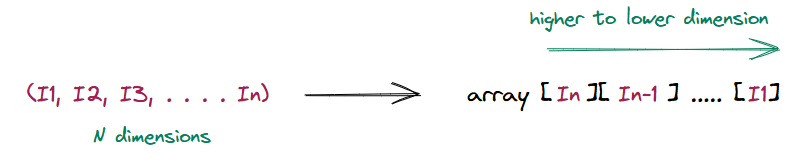

## Defining dimensions for arrays

Before devising a solution for the problem mentioned earlier, let's first understand what a dimension is and what it emans in the context of arrays.

> **What is a dimension?**\
A dimension can be visually thought of as an independent direction in space. For example, anything drawn on paper has only two dimensions: height and width. However, anything in the real world has a third dimension: depth. We live in a three-dimensional world, so it is easy to visualize three dimensions.

However, mathematically speaking, the dimensions of an object is the minimum number of coordinates needed to specify any point in it. When talking about arrays, it is easy to visualize up to three-dimensional arrays and see what these coordinates mean (row, column, depth).

  * Visualizing three dimensions

Even though we cannot visualize anything beyond the three dimensions, we can mathematically create and work with any number of dimensions we want. In the context of an array, the terms N-dimensional and multidimensional array are used interchangeably and mean the same thing, i.e. a multidimensional array with N dimensions.

When we move to higher dimensions, the notion of rows, columns, and depth breaks down. However, we can still define an array in mathematical terms. Let us consider an example of an N-dimensional array that has dimensions `D1, D2, D3 ... Dn`. 

> In almost all modern programming languages, the dimensions are written from **higher to lower**, like `Dn x Dn-1 x Dn-2 ... D1` where the `Di` is the size of the `ith` dimension.

  * Dimensions are written from higher to lower in most programming languages

To access a data item and index `I1, I2, I3 .. In`, we use the same **higher-to-lower** notation in almost all programming languages. We use the method given below to find the base address of the data item at the index `[Id][Id-1] .. [I1]`.

  * Dimensions are written from higher to lower in most programming languages when accessing items at the corresponding coordinate.