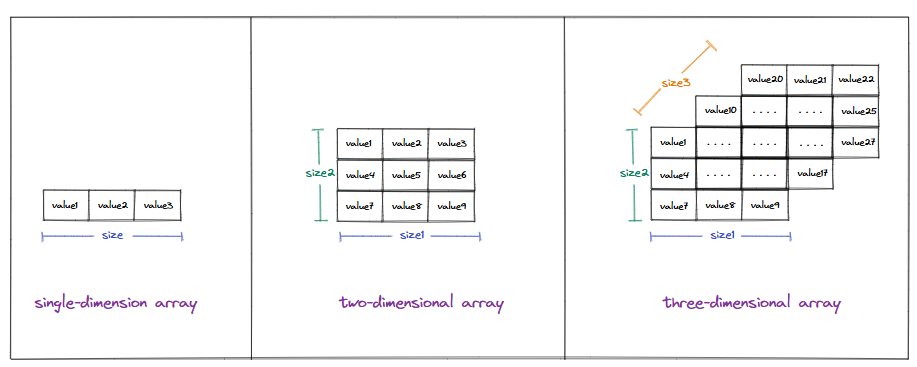
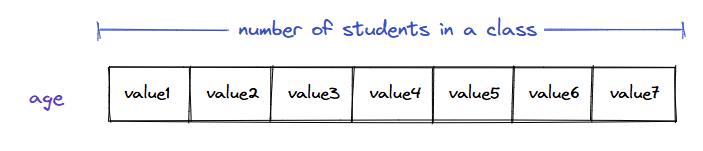
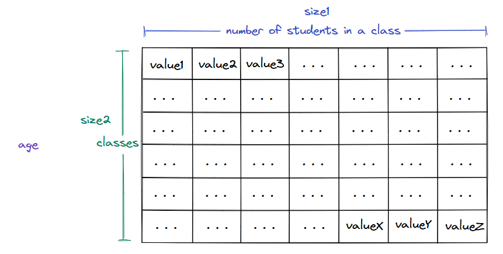
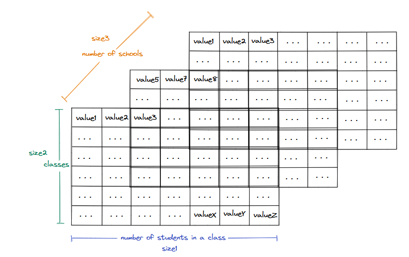

## Exploring a possible solution

Now that we know the limitations of single-dimension arrays and the situations where those limitations prevent us from designing solutions, we can understand how we can extend the array to add more dimensions to it and design cleaner and more efficient solutions.

### Mulitdimensional arrays

A multidimensional array is an array of arrays. It is just a regular array, but instead of storing any primitive or user-defined datatype, it stores an array (single or multidimensional) as its data item. The depth to which this goes (array of arrays) is called the **dimension** of the array. There is no limit to the depth to which this can go, and so there can be:

> * **Single dimension array** - An array of non-array datatype
> * **Two-dimension array** - An array of arrays of non-array datatype
> * **Three dimension array** - An array of arrays of non-array datatype
> * And this can go on

Let us look at the logical representation of multidimensional arrays

   * Logical representation of multidimensional arrays

### Importance of multidimensional arrays

To understand how multidimensional arrays are useful and what a dimension represents, let us revisit the problem of storing the ages of all students in a class.

### One dimensional array

Instead of storing each student's age in a separate variable, we can use a regular (one-dimensional) array to store all this data under a single variable. The size of the array would be equal to the number of students in the class (`size1`)

   * Storing the ages of students in  a single class in a single dimension array

### Two dimensional array

Let's extend this problem to all classes (`size2`) in the school. We can solve this problem by storing children's ages in each class in a separate one-dimensional array, but that would not scale well if we had hundreds of classes. A two-dimensional array can help us solve this problem: we can create a two-dimensional array (an array of arrays) where the inner array stores the ages of all students in a class, and the outer array is an array of such inner arrays (different classes). This two-dimensional array (outer array) has a size `size2` where each data item is an array (inner array) of size `size1`.

   * Storing the age of students in all classes in a two dimensional array

### Three dimensional array

Extending this problem further, consider a situation where we need to store the age of all students across all classes and all schools in a city (`size3`). In this case, instead of creating multiple two-dimensional arrays, we can create a single three-dimensional array to store all the data in just one variable. This three-dimensional arry to store all the data in just one variable. This three-dimensional array would be an array of size `size3`. Each data item in this array will be a two-dimensional array of size `size2` where each data item will also be an array of size `size1`. This way, we can store all the data in a single variable.

   * Storing the age of students in all classes in across many schools in a three-dimensional array