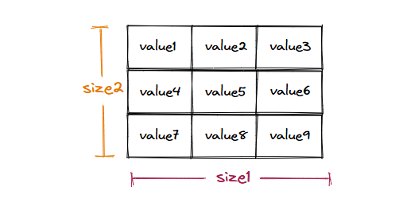
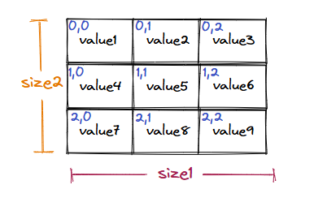
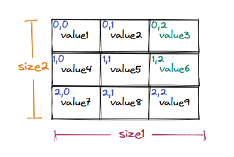
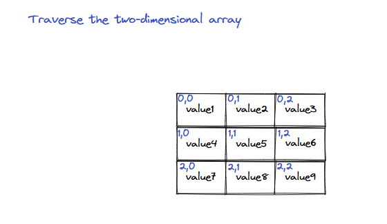

## Overview of supported operations

Now that we know the logical representation of a multidimensional array, let's look at how to create, update, and traverse one. In most modern programming languages, these operations are very similar and follow the same rules as those of a single-dimensional array.

### Construction

Almost all the major programming languages support adding more dimensions to a regular array in one form or another. Since a mulidimensional array is just an array, it has a fixed size that cannot be modified after creation. All data items in the array must be of the same data type.


   * Creating a multidimensional array of fixed size and datatype

Higher-level programming languages like JavaScript and Python inherently only provide a list instead of an array. A list behaves just like an array, but has a dynamic size and can store elements of different data types. Thus, the programmer doesn't need to provide a size when declaring or initializing a multidimensional array.

```python
# Since Python lists are dynamic all they can be extended
# after creation

from typing import List

#1. Declaring a 2D array of size 2x3 (zeros)
numbers2d: List[List[int]] = [[0 for _ in range(3)] for _ in range(2)]

# 2. Declaring a 3D array of size 2x3x2 (zeros)
numbers3d: List[List[List[int]]] = [[[0 for _ in range(2)] for _ in range(3)] for _ in range(2)]

# 3. Initializing a 2D array
numbers2d_init: List[List[int]] = [
    [1, 2, 3],
    [4, 5, 6]
]

# 4. Initializing a 3D array
numbers3d_init: List[List[List[int]]] = [
    [ [1, 2], [4, 5], [7, 8] ],
    [ [9, 10], [11, 12], [13, 14] ]
]

# 5. Dynamic 2D array
rows: int = 2
cols: int = 3
dynamic2d: List[List[in5]] = [[0]*cols for _ in range(rows)]
```

### Accessing elements

We can access data items in a multidimensional array like a regular array using the subscript operator `[]` and an index. Since every data item in a multidimensional array is also an array, we chain the subscript operator to access the data item in the internal array. We can continue chaining the subscript operator until we reach a non-array data item.


   * Multidimensional array elements can be accessed using indices for all dimensions

Different programming languages provide different ways of accessing elements within a multidimensional array. However, the underlying mechanism to access the element is the same.

```python
from typing import List

# Initializing a 2D array
numbers2d: List[List[int]] = [
    [1, 2, 3],
    [4, 5, 6]
]

# Accessing elements using [row][column]
print("Element at (0,0):", numbers2d[0][0])
print("Element at (1,2)", numbers2d[1][2])

# Initializing a 3D array
numbers3d: List[List[List[int]]] = {
    [ [1, 2], [3, 4], [5, 6] ],
    [ [7, 8], [9, 10], [11, 12] ]
}

# Accessing elements using [depth][row][column]
print("Element at (0,1,1):", numbers3d[0][1][1])
print("Element at (1,2,0):", numbers3d[1][2][0])
```

### Modifying elements

We can modify data items in a multidimensional array in place, just like a regular array. We chain the subscript operator as many times as there are dimensions with the correct indices to access the data item we want to modify and update its value by writing the accessor `array[In][In-1]...[I1]` on the left-hand side of the assignment operator and the value to be assigned on the right-hand side.


   * Multidimensional array elments can be modified using indices for all dimensions

Different programming languages implement the underlying operations differently. However, the result is the same.

```python
from typing import List

# Initializing a 2D array
numbers2d: List[List[int]] = [
    [1, 2, 3],
    [4, 5, 6]
]

# Modifying elements in 2D array
numberrs2d[0][0] = 10
numbers2d[1][2] = 60

# Initializing a 3D array
numbers3d: List[List[List[int]]] = [
    [ [1,2], [3,4], [5,6] ],
    [ [7,8], [9,10], [11,12] ]
]

# Modifying elements in 3D array
numbers3d[0][1][1] = 40
numbers3d[1][2][0] = 110
```

### Traversal

We need nested loops to iterate over all the indices in every dimension to traverse a mutlidimensional array. The logic is simple and just an extension of the single-dimensional array traversal.


   * Traversing a multidimensional array using a nested loop iterative indices for all dimensions

The order of these loops affects the performance of the code depending on the order in which the array items are stored in the memory. We will learn more about this when we learn how a multidimensional array is stored in memory.

```python
from typing import List

# Initializing a 2D array
numbers2d: List[List[int]] = [
    [1, 2, 3],
    [4, 5, 6]
]

# 1. Index-based for loop (2D)
print("2D array traversal (index-based):")
for i in range(len(numbers2d)):
    for j in range(len(numbers2d[i])):
        print(numbers2d[i][j], end=" ")
    print()

# 2. For-each loop (2D)
print("2D array traversal (for-each):")

```