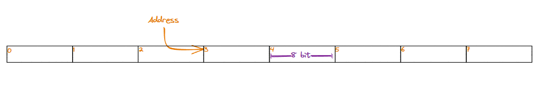
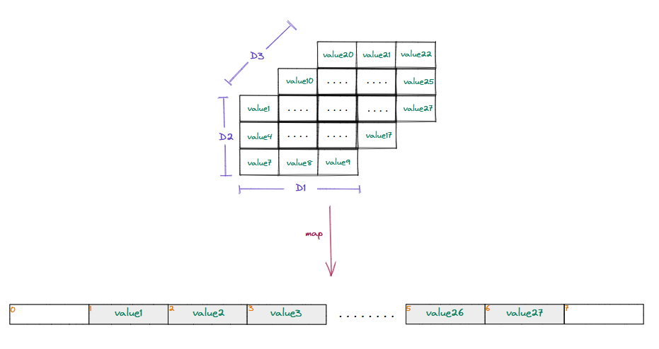

## Internal mechanics of multidimensional arrays

So far, we have learned what a mulitdimensional array is and how it solves problems that involve storing and manipulating large numbers of data items easily. We can now look at how multidimensional arrays work under the hood and how they are stored in memory.

### Memory addresses

Let us revisit our memory model before diving deeper into how multidimensional arrays are stored in memory. Memory is logically organized in RAM as a **linear/single-dimensional** sequence of blocks. Every block has a unique identifier that serves as its address and can be used to locate it in memory. Data in memory can only be acccessed if its address is known.

> Computer memory is logically organized as a **linear** sequence of blocks.

   * Memory is logically organized as a linear sequence of blocks

### Storing multidimensional arrays

Remember, computer memory is organized as one-dimensional, linear sequence of blocks, so multidimensional arrays cannot be store directly. To represent an N-dimensional arra in memory, we must map it ont a one-dimensional array.

   * Multidimensional arrays have to be mapped to a single-dimensional memory

For a programmer, data is logically stored in an N-dimensional space, so it is accessed using N indices that represent its coordinates in the N-dimensional space. However, since the data is physically stored in memory (which is single-dimensional), there must be very fast and efficient ways to convert the N-dimensional indices to a single index where the data is stored in memory.

> **What are serialization and deserialization?**\
\
**Serialization** converts data objects from one form to another to make storage and transmission easier while preserving state information.\
**Deserialization** converts the serialized data back to the original data objects in their original form.

Different techniques can be used to map an N-dimensional array into a single-dimensional memory. The most common techniques are given below.

> * Row major ordering
> * Column major ordering

In the next lessons, we will examine these ordering techniques in depth and the programming languages that use these orderings for storing multidimensional arrays.