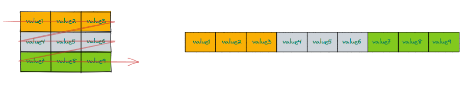
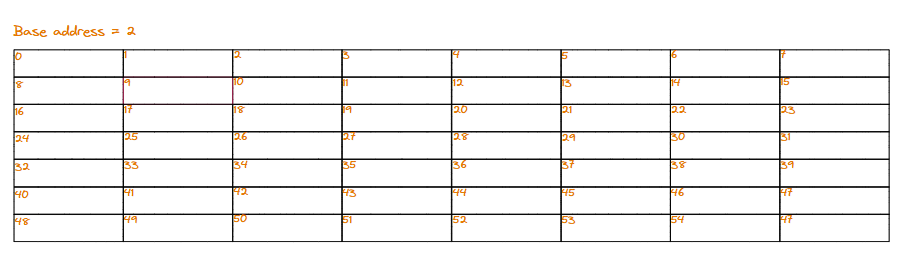
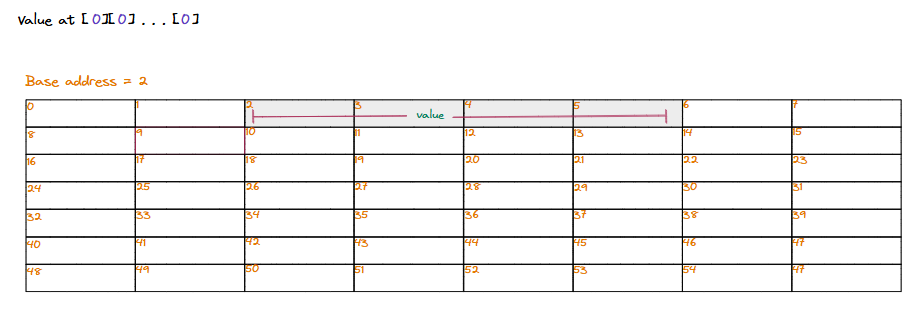
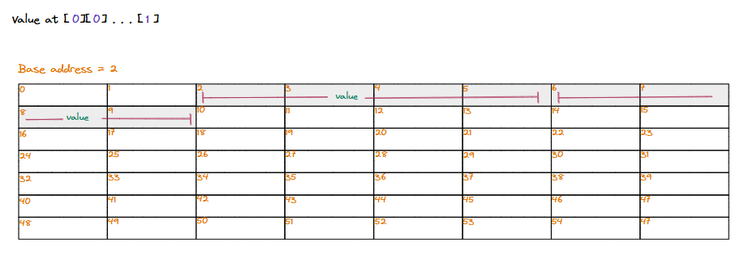
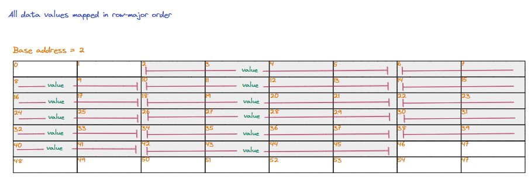
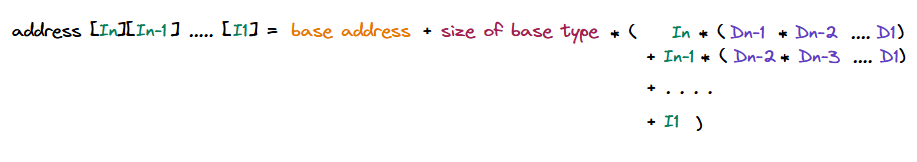

## Understanding row major order

The row-major is the simplest and most intuitive order for storing multidimensional arrays. It is one way to serialize/deserialize a multidimensional array to and from a single-dimensional/linear sequence.

> **What programming languages store arrays in row major order?**\
Multidimensional arrays in programming langauages like C, C++, Objective C, etc., are stored in the row major order.

In this order, consecutive elements in a **row** (as seen in the logical representation) of an array are placed consecutively to each other in the memory.

   * Generic representation of two dimensional array in row major order in memory

### Layout in memory

Let us consider an example of an N-dimensional array that has dimensions `Dn x Dn-1 x Dn-2 ... D1` where `Di` is the size of the ith dimension.

It is hard to visualize the logical representation of this array. Row-major ordering is a way to serialize this multidimensional array into a single-dimensional/linear sequence of elements to store it in memory, which is also single-dimensional/linear.

> We iterate through all values in the array, with the **lowest dimension moving fastest**, and store element s sequentially in memory.

...

   * Row major order lays out elements by moving the lowest dimension the fastest

### Accessing elements

Now that we know what row-major ordering is and how it applies to a multidimensional array, it is easy to figure out a mathematical formula to calculate the address of an element, an index `In, In-1, In-2 ... I1` if we know the **base address** (where the multidimensional array starts in memory) and the **size** of each element.

   * Calculating the base address of value at (In, In-1 ... I1)