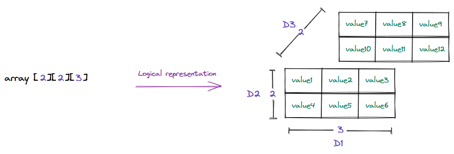
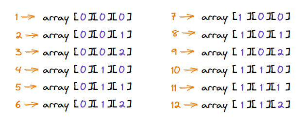
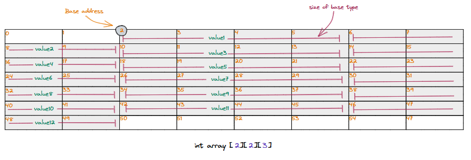
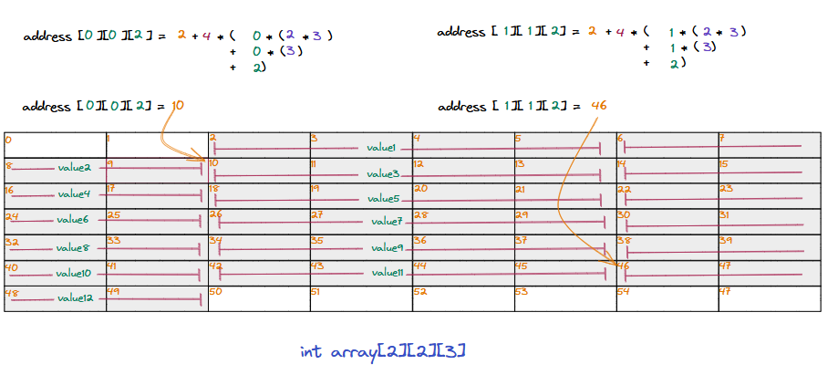
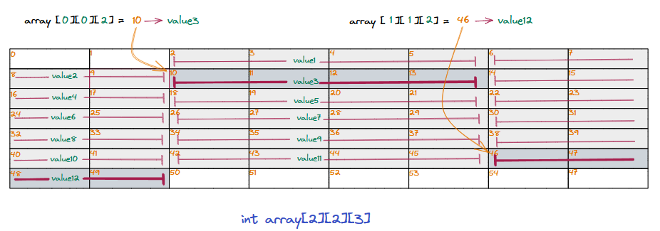

## Example of row major order

Now that we know how the row-major order is used to serialize a multidimensional array into a single-dimensional/linear sequence of data, we can use a three-dimensional array as an example to visualize this and understand what happens under the hood when we try to access an element in a multidimensional array.

Let us consider an example of a three-dimensional (2x2x3) integer array where `D3 = 2`, `D2 = 2` and `D1 = 3`. The logical representation of the three-dimensional array is given below. 

   * Logical representation of a three-dimensional array where D3=2, D2=2 and D1=3

### Layout in memory 

We apply the same method we learned to lay out the three-dimensional array into a single-dimensional/linear sequence of elements and map it into memory. When mapping the three-dimensional array into the single-dimensional memory using row-major ordering, the lowest dimensions the fastest. The order in which elements will be laid out in the memory is given below. 

   * The loweset dimension moves the fastest in row-major order

For this example, let's consider **base address 2**. Because this is an integer array, we consider the size of each element to be **4 bytes**. Let us look at what the row-major ordering for the three-dimensional array described above will look like in memory. The same order is followed, and elemnents are placed individually in the memory. 

   * Structure of the three dimensional array stored in row major order in memory

### Calculating the addrss of elements

When we use the subscript operator with indices to access an element in a multidimensional array, the address of that item is calculated using the formula we learned earlier. The program knows the dimensions of the array, the base address, and the size of the stored datatype. This is the only information needed to access data at any index.

Let us now see how the subscript operator internally works to calculate the address of values stored at `array[0][0][2]` and `array[1][1][2]`.

   * Calculating the base address for array[0][0][2] and array[1][1][2] using subscript operator

### Dereferencing the value

Once the subscript operator resolves the address of the underlying element, the next step is to dereference it to access its value. The programming language is aware of the size of the datatype at the resolved base address, and it interprets the sequence of bytes starting at that address accordingly.

> **Pointers in low-level languages** \
\
Programming languages like C, C++, etc., provide pointers that can store memory addresses and manipulate any part of the continuous memory segment as the programmer sees fit.

   * Dereferencing data at base addresses by looking at datatype of stored item

> In this example, we considered an array of 4-byte integers, but the underlying implementation is the same for any other datatype.

All this magic happens under the hood for almost all modern programming lanugages, so the programmer does not have to worry about these things when developing software. They can use the array data structure to store data of any datatype they wish, and the programming language will take care of the underlying logic when they use the subscript operator to access or modify items in the array.