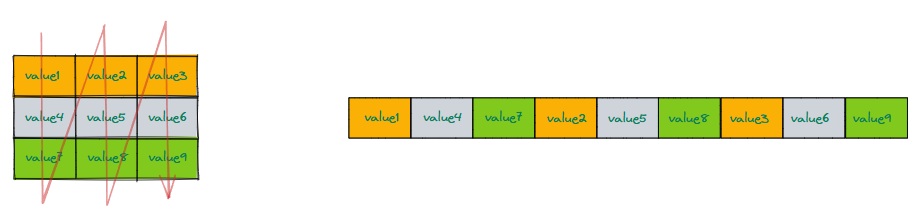
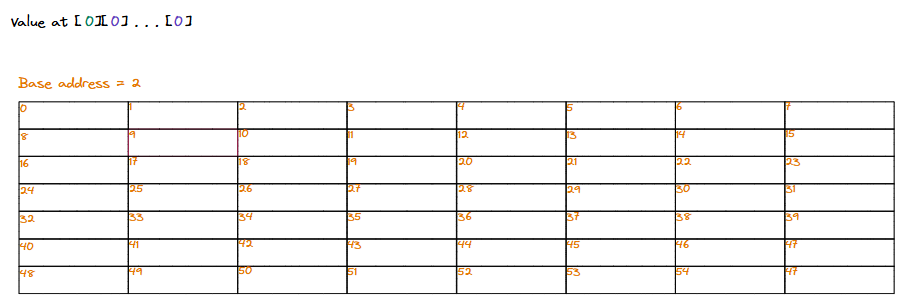
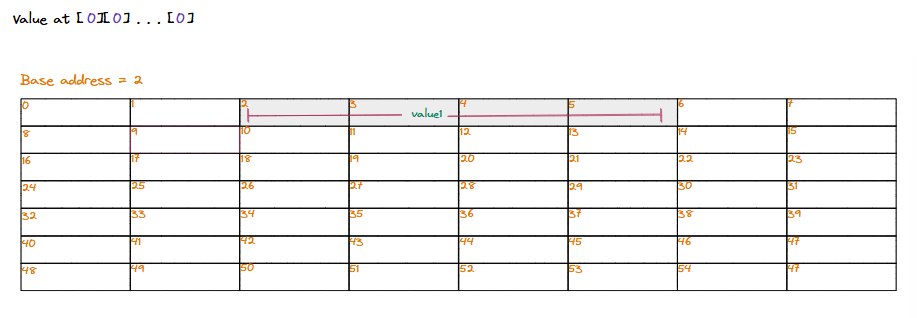
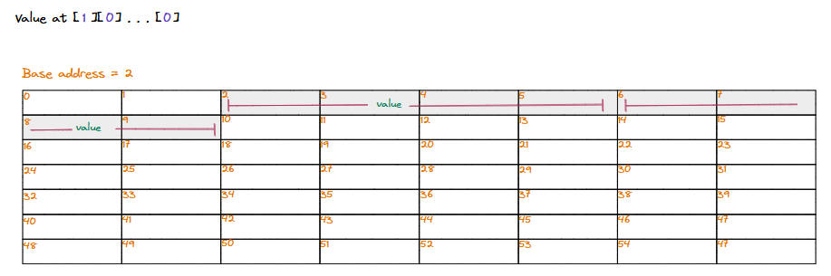
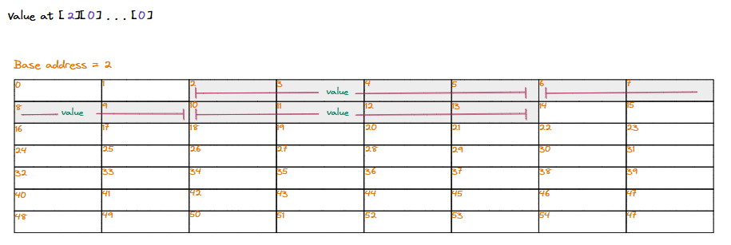
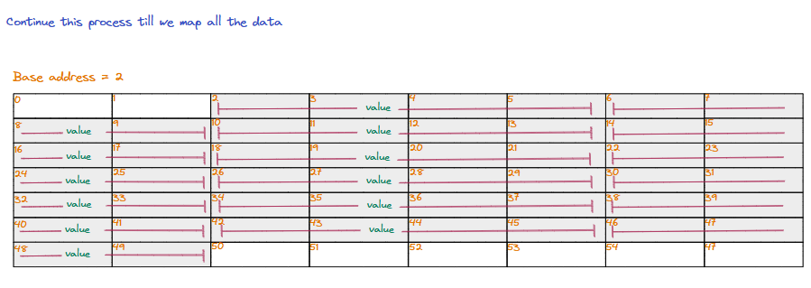
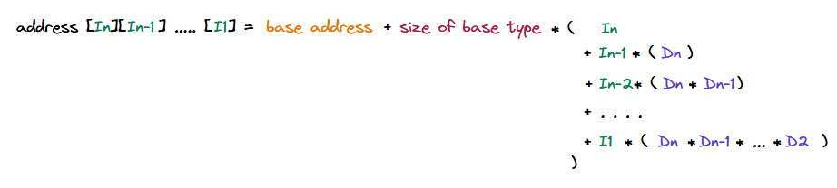

## Understanding column major order

The column-major order can be considered the converse/transpose of the row-major order. It is also one of the ways by which we can serialize/deserialize a multidimensional array to and from a single-dimensional/linear sequence.

> **What programming languages store arrays in column major order?** \
\
Multidimensional arrays in mathematical/scientific computing programming languages like Fortran, MATLABL, Julia, etc., are stored in the columnn major order.

In column-major order, consecutive elements in a **column** (as seen in the logical representation) of an array are placed consecutively to each other in the memory.

   * Generic representation of two dimensional array in column major order in memory

### Layout in memory

Let us consider an example of an `N`-dimensional array that has dimensions `Dn x Dn-1 X Dn-2 ... D1` where the `Di` is the size of the `ith` dimension.

It is hard to visualize the logical representation of this array. Column-major ordering is a way to serialize this multidimensional array into a single-dimensional/linear sequence of elements to store it in memory, which is also single-dimensional/linear.

> **Highest dimension moves fastest** \
\
We iterate through all values in the array, with the **highest dimension moving fastest**, and store elements sequentially in memory.

...

   * Column major orders lays out elements by moving the highest dimension the fastest

### Accessing elements

Now that we know what column-major ordering is and how it applies to a multidimensional array, it is easy to figure out a mathematical formula to calculate the address of an element at index `In, In-1, In-2 ... I1` if we know the **base address** (where the multidimensional array starts in memory) and the **size** of each element.

   * Calculating the base address of value at (In, In-1 ..... I1)