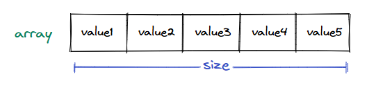

### Overview of supported operations

Now that we now the logical representation of an array, let's examine how to create, update, and traverse one. Almost all major programming languages support arrays in some form.

### Creating an array

The syntax and rules for creating an array depend on the programming language. An array with a fixed size cannot be modified after creation, and all data items in an array must be of the same type.


  * Creating an array of fixed size and datatype

Higher-level programming languages like JavaScript and Python inherently only provide a list instead of an array. A list behaves just like an array, but has a dynamic size and can store elements of different data types. However, the underlying machine-level implementation still uses the basic arrays as the core data structure, which has a fixed size and type.

```python
from typing import List

# Python lists are dynamic and can grow or shrink at runtime

# Declaring an array (list) of fixed size with default values
numbers: List[int] = [0] * 5

# Declaring and initializing an array
numbers2: List[int] = [1, 2, 3, 4, 5]

# Creating an array of size N
size_n: int = 5
numbers3: List[int] = [0] * size_n

# Creating and initializing using list comprehension
nubmers4: List[int] = [i for i in range(5)]
```

### Accessing elements in an array

An array is just a collection of data items stored in continuous memory. This continuous memory layout allows us to access its elements using indices. We use the subscript operator `[]` with an index to access data items in an array.

> **Why do array indices start from 0 instead of 1?**\
\
> Array indices start from 0, indicating an element's **relative** position from the array's beginning. This makes the element at index 0 the first element, the element at index 1 the second, and so on.


  * Array elements are accessed via their indices.

Different programming languages provide different ways of accessing elements within an array. However, the underlying access mechanism is the same for all.

